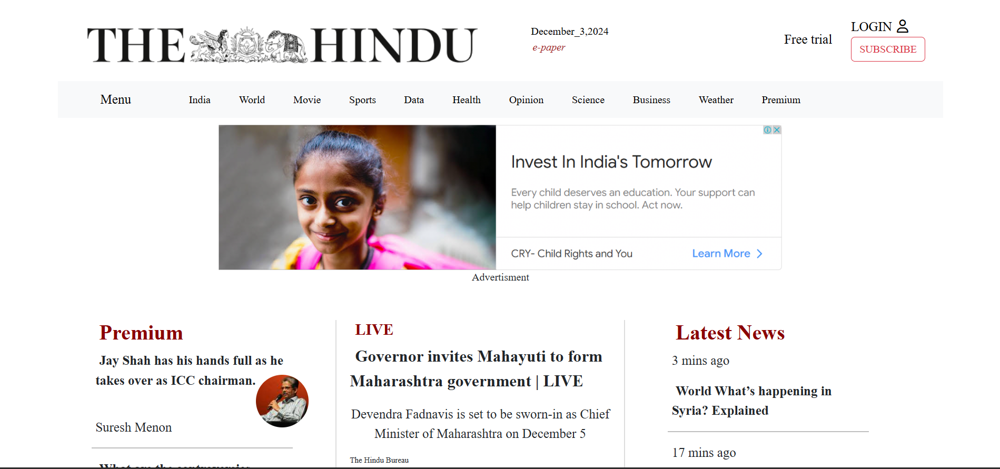
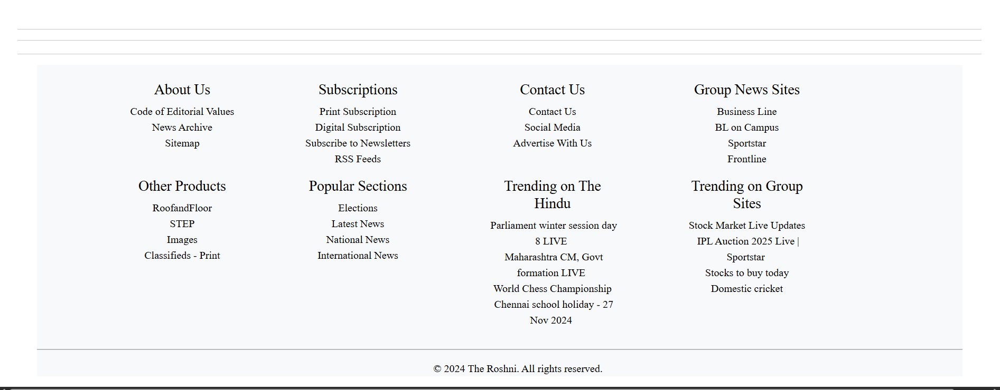

---

# 📰 **The Hindu Newspaper Clone** – *Stay Updated, Anytime, Anywhere!* 🌍

---

## 📖 Description

Welcome to the **Hindu Newspaper Clone** — a sleek, modern, and fully responsive replica of the iconic **The Hindu** news website! 📱📰

Whether you're catching up on the latest headlines 🌎, diving into word games 🎮, or browsing featured articles 📚, this project brings the power and feel of a real news platform to your fingertips.

Built using modern web technologies, this clone offers a clean user interface, interactive features, and a layout designed to mimic real-world media websites. Perfect for **frontend developers**, **UI/UX learners**, and **news lovers** alike.

---

## 🔥 Features

* ✅ **Clean & Responsive Design**
  Optimized for all devices – mobile, tablet, and desktop 📱💻.

* 📰 **News Highlights & Breaking Sections**
  Realistic layouts for headlines, featured news, and category-specific content.

* 🎯 **Interactive Word Games**
  Includes fun, in-browser games like **Spelling Bee 🐝**, **Crossword 🧩**, and more!

* 📎 **Fully-Structured Footer**
  Footer with navigation links, subscription details, and service pages.

---

## 🛠️ Technologies Used

* **HTML5** – Structure & semantics
* **CSS3** – Visual design & animations
* **Bootstrap 5** – Responsive grid & components
* **JavaScript** – Interactivity and DOM manipulation
* **Icon Libraries** – Smooth and sharp visual elements (e.g., Font Awesome)

---

## 📸 Live Preview (Screenshots)

> Add screenshots of different sections like homepage, games, article layout, and footer.

```
📁 /images/
├── homepage.png
├── news-section.png
├── games.png
├── footer.png
```

```markdown
  
*Clean and bold homepage layout with headlines*

  
*Interactive puzzle games directly on the site*

  
*Full-featured footer with quick links and navigation*
```

---

## 📄 License

This project is open-source and intended for **educational and personal learning purposes only**. 🎓
No affiliation with the original *The Hindu* website or brand.

---

## 🚀 Want to Customize?

Fork the repo, add your own news data or game logic, and make it uniquely yours! 🛠️
It’s a great way to learn frontend development and build your portfolio.

---
